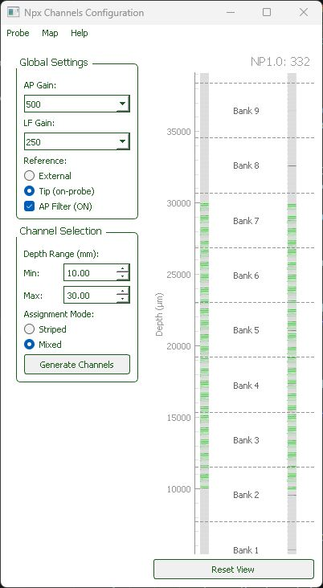
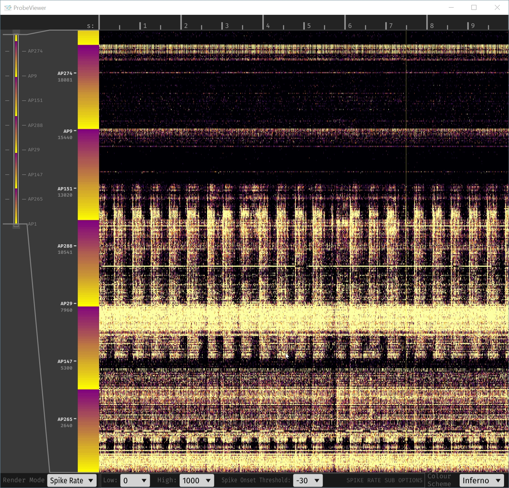
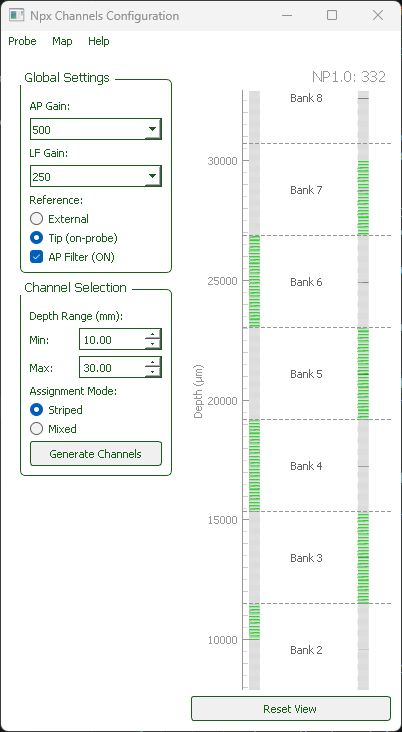

# IMRO Neuropixels Generator


Neuropixels probe channel configuration tool. Create IMRO files for SpikeGLX/OpenEphys and export probe configurations for Kilosort.

**Problem:** The [OpenEphys Neuropixels Plugin](https://open-ephys.github.io/gui-docs/User-Manual/Plugins/Neuropixels-PXI.html) can load [SpikeGLX IMRO](https://billkarsh.github.io/SpikeGLX/help/imroTables/) files but provides no tool to create them.

**Solution:** IMRO Generator lets you configure which electrodes to record from based on depth coverage, then export as IMRO files or [Kilosort probe dictionaries](https://kilosort.readthedocs.io/en/latest/tutorials/make_probe.html).
## Installation

**New to probe configuration?** Start here:

1. **Install**: `pip install -e .` (requires Python 3.8+)
2. **Launch**: `imro-gui`
3. **Quick guide**: See [`QUICKSTART.md`](QUICKSTART.md)

The GUI lets you:
- Choose your recording depth range (0–44.16 mm)
- Select assignment mode (Striped or Mixed) for uniform electrode distribution
- Configure gains, filters, and reference type
- Save IMRO files for OpenEphys/SpikeGLX
- Load and modify existing IMRO configurations

## For Developers

**Integrating into your software?** See:

- [`DEVELOPERS.md`](DEVELOPERS.md) — Architecture, setup, extending
- `docs/imro_algorithm.md` — Algorithm specification
- `docs/imro_dev_guide_A_overview.md` — Detailed architecture
- `tests/` — Test suite with examples

## System Requirements

- **Python**: 3.8 or later
- **GUI dependencies**: PyQt5, pyqtgraph (installed automatically)
- **Data processing**: NumPy (installed automatically)

## Installation

```bash
# Standard installation
pip install -e .

# With development tools
pip install -e ".[dev]"  # (if extras defined in setup.py)

# From source (if cloning)
git clone <repo-url>
cd imro-generator
pip install -e .
```

## Example use

### Mapping 2cm from the tip up

example file `20mm.imro` in action, as seen in [`OpenEphys Probe Viewer`](https://open-ephys.github.io/gui-docs/User-Manual/Plugins/Probe-Viewer.html), when flashes of light (2Hz) are shown to a fixating subject, while Neuropixels1.0-NHP is inserted in a visual area. 



### Picking an active region for recording



Set boundaries 10mm to 30mm

Map -> Save as IMRO 

Map -> Save kilosort probe

## Helpful Resources

- **[OpenEphys Neuropixels Plugin](https://open-ephys.github.io/gui-docs/User-Manual/Plugins/Neuropixels-PXI.html)** — GUI for recording with Neuropixels probes, loads IMRO files
- **[SpikeGLX IMRO Format](https://billkarsh.github.io/SpikeGLX/help/imroTables/)** — Complete IMRO specification and format documentation
- **[Kilosort Probe Dictionary](https://kilosort.readthedocs.io/en/latest/tutorials/make_probe.html)** — Format for probe configurations in Kilosort4
- **[Neuropixels Probe 1.0 NHP](https://www.neuropixels.org/probe-1-0-nhp-long)** — Official probe specifications
